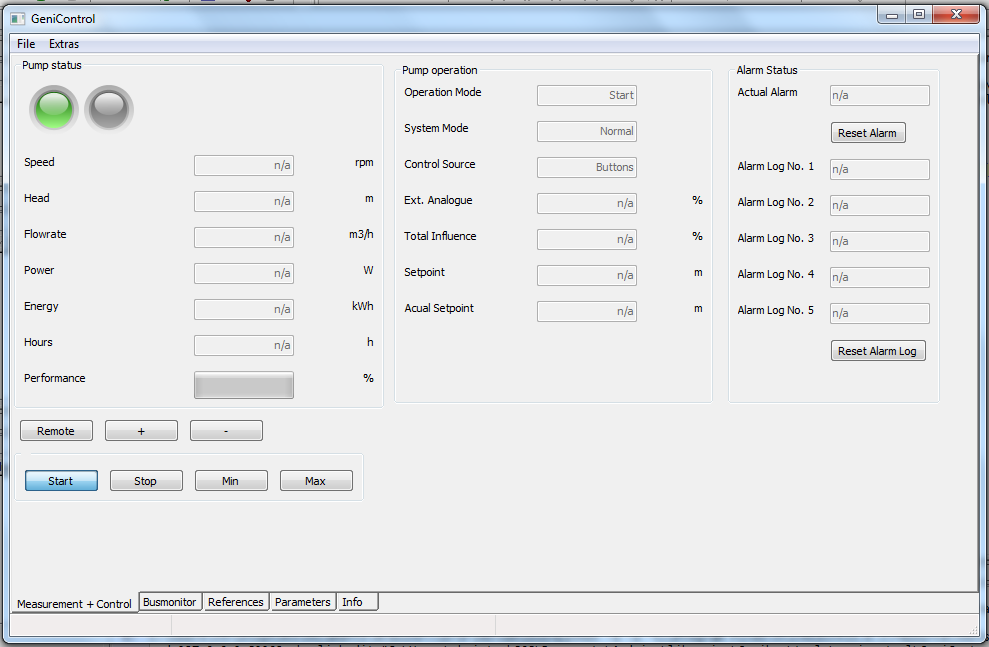

# GENIBus-Arduino

Grundfos GENIBus Library (not only) for Arduino boards.

## Features

- Hardware-independent GENIBus communication routines.
- GeniControl: visualization and control for MAGNA/UPE pumps.
- Arduino examples and pass-through server sketches.



## Development Setup (WP1 baseline)

This repository is being migrated to a modern `pyproject.toml` based setup.
The Python package now uses a `src/` layout.

### Requirements

- Python 3.10+
- `pip`

### Install (editable)

```bash
python -m pip install --upgrade pip
python -m pip install -e .[dev]
```

### Run checks

```bash
ruff check .
black --check .
mypy src
pytest --cov=genibus --cov-report=term
```
